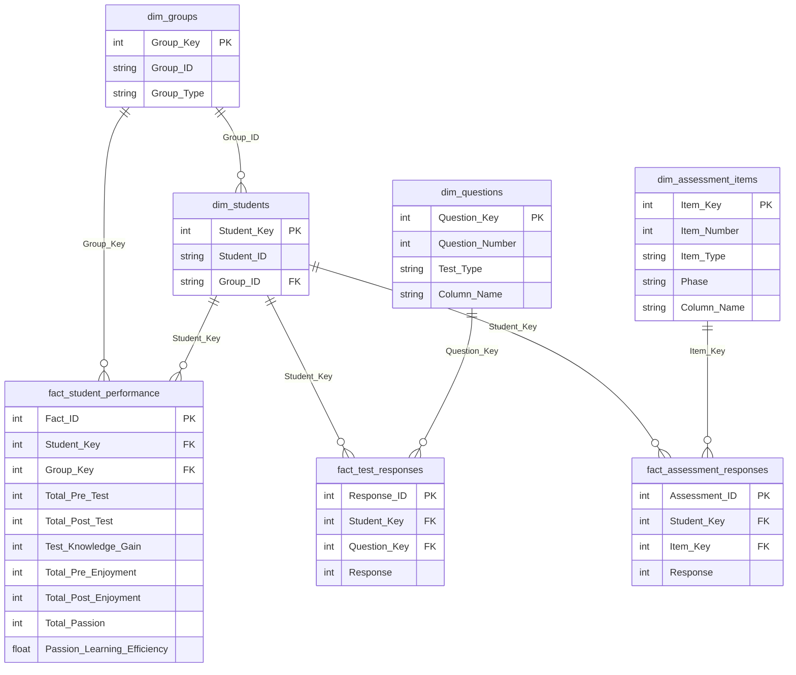

# NHA-4-20
# 🎓 Smart Student Performance Analytics
### NHA-4-20 | DEPI Round 4 — Data Engineering Track


---

## 📌 Project Overview

This project analyzes student performance data from the **DEPI Round 4** 
program, evaluating the impact of robot-assisted learning on educational 
outcomes across two student groups:

- **GP1_Robot** — 84 students
- **GP2_Robot_Advanced** — 98 students

The system processes pre/post test scores, enjoyment scales, and passion 
indicators through a complete data engineering pipeline — from raw Moodle 
exports to an interactive Power BI dashboard.

---

## 🎯 Research Questions

### 📚 Knowledge & Performance
- What is the average knowledge gain across all students?
- Is there a significant difference between GP1 and GP2?
- Which group achieved higher post-test scores?

### 😊 Enjoyment & Engagement
- Did student enjoyment improve after the intervention?
- Is there a correlation between enjoyment and knowledge gain?

### 🔥 Passion & Efficiency
- What is the average passion learning efficiency?
- Is passion correlated with knowledge gain?

---

## 📊 Key Results

| Metric | GP1_Robot | GP2_Robot_Advanced | All Students |
|--------|-----------|-------------------|--------------|
| Students | 84 | 98 | 182 |
| Avg Pre-Test | 27.5 | 27.8 | 27.69 |
| Avg Post-Test | 55.6 | 55.8 | 55.71 |
| Avg Knowledge Gain | 28.1 | 28.0 | 28.03 |
| Avg Pre-Enjoyment | 77.0 | 77.2 | 77.10 |
| Avg Post-Enjoyment | 82.8 | 83.1 | 82.96 |
| Avg Passion | 75.4 | 75.7 | 75.55 |
| Passion Efficiency | 0.74 | 0.74 | 0.74 |

### 🔬 Statistical Findings

| Hypothesis | Test | Result | p-value |
|------------|------|--------|---------|
| Knowledge gain is significant | Paired T-Test | ✅ Significant | < 0.001 |
| GP1 ≠ GP2 in knowledge gain | Independent T-Test | ❌ No difference | 0.914 |
| Enjoyment improved | Paired T-Test | ✅ Significant | < 0.001 |
| Passion correlates with gain | Pearson Correlation | ✅ r = -0.706 | < 0.001 |

---

## 🗄️ Database Schema (Star Schema)



### 📋 Tables Summary

| Table | Type | Rows | Description |
|-------|------|------|-------------|
| `dim_groups` | Dimension | 2 | GP1_Robot, GP2_Robot_Advanced |
| `dim_students` | Dimension | 182 | Anonymized student identifiers |
| `dim_questions` | Dimension | 140 | Pre/Post test questions (70 each) |
| `dim_assessment_items` | Dimension | 94 | Enjoyment (64) + Passion (30) items |
| `fact_student_performance` | Fact | 182 | Core metrics per student |
| `fact_test_responses` | Fact | 12,740 | Individual question responses |
| `fact_assessment_responses` | Fact | 17,108 | Individual assessment responses |

---

## 🛠️ Technology Stack

| Tool | Purpose |
|------|---------|
| **Python (pandas, scipy, numpy)** | Data cleaning, preprocessing, statistical analysis |
| **SQLite** | Star schema database, FK integrity |
| **Power BI** | Interactive dashboard, KPI visualization |
| **GitHub** | Version control, documentation |
| **Excel** | Reporting and exploratory analysis |

---

## ⚙️ Installation & Setup

### 1. Clone the Repository
```bash
git clone https://github.com/AlshaimaaFouad/NHA-4-20.git
cd NHA-4-20
```

### 2. Install Requirements
```bash
pip install pandas numpy scipy statsmodels openpyxl matplotlib seaborn
```

### 3. Run Data Pipeline
```bash
# Build star schema database
python build_star_schema.py
```

### 4. Open Power BI Dashboard

